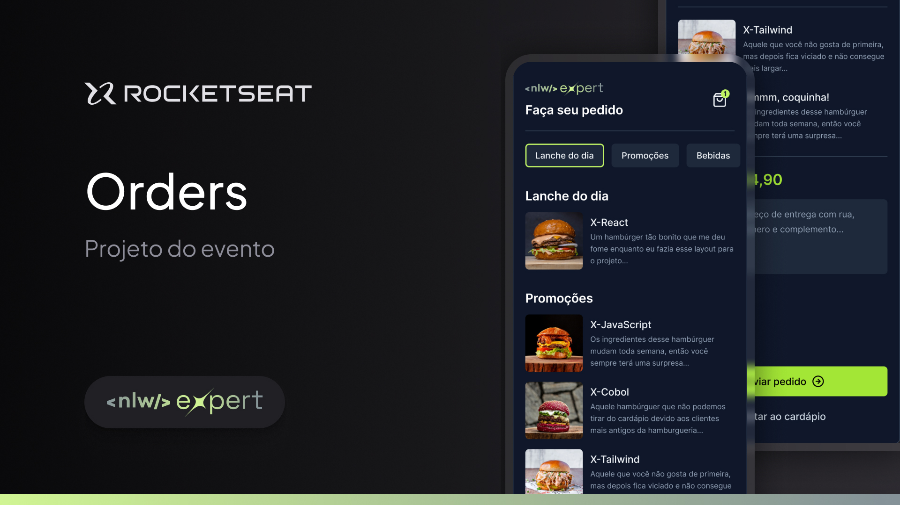

<h1 align="center">Trilha React Native</h1>

Projeto exclusivo e gratuito, promovido pela Rocketseat para ensino de tecnologias Mobile.

  <a href="#-tecnologias">Tecnologias</a>&nbsp;&nbsp;&nbsp;|&nbsp;&nbsp;&nbsp;
  <a href="#-projeto">Projeto</a>&nbsp;&nbsp;&nbsp;|&nbsp;&nbsp;&nbsp;
  <a href="#-layout">Layout</a>&nbsp;&nbsp;&nbsp;|&nbsp;&nbsp;&nbsp;
  <a href="#memo-licença">Licença</a>

  

 

  

## 🚀 Tecnologias

Esse projeto foi desenvolvido com as seguintes tecnologias:

- React Native
- Expo
- Zustand
- Tailwindcss com NativeWind
- TS
- Expo Router
## 💻 Projeto

Uma aplicação de delivery, onde o usuário pode visualizar e selecionar produtos do cardápio e enviar seu pedido pelo WhatsApp para o estabelecimento 🏪

## 🔖 Layout

Você pode visualizar o layout do projeto através [DESSE LINK](https://www.figma.com/file/BLg4tmpyOVFWGYOMxTgTku/NLW-expert-%E2%80%A2-Orders-(Community)?type=design&node-id=2-287&mode=design&t=Cjb1oyKT3zenEaC9-0). É necessário ter conta no [Figma](https://figma.com) para acessá-lo.

## :memo: Licença

Esse projeto está sob a licença MIT.

---

Feito com ♥ by Rocketseat :wave: [Participe da nossa comunidade!](https://discord.gg/rocketseat)
